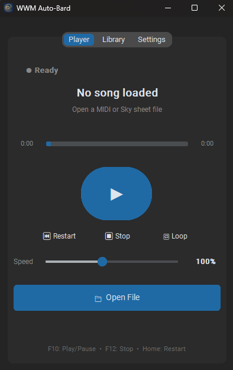
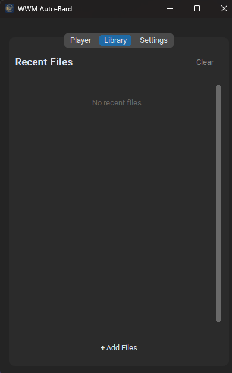
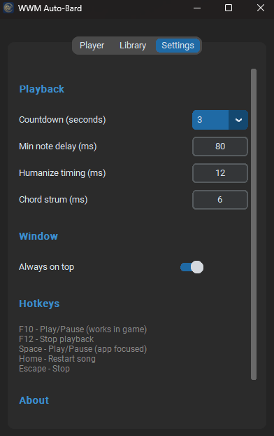

<div align="center">

# 🎵 WWM Auto-Bard

**Play beautiful music in Where Winds Meet — automatically.**

Transform MIDI files and Sky: Children of the Light sheets into live performances.

[](https://github.com/feb027/wwm-autobard/releases)
[](https://github.com/feb027/wwm-autobard/releases)
[](LICENSE)

<br>



[**Download**](https://github.com/feb027/wwm-autobard/releases/latest) · [**Features**](#-features) · [**Getting Started**](#-getting-started) · [**Find Songs**](#-finding-songs)

</div>

---

## ✨ Features

<table>
<tr>
<td width="50%">

### 🎹 Smart Playback
- **Auto-transpose** to fit the game's 36-key range
- **Track selection** for multi-track MIDIs
- **Speed control** from 25% to 200%
- **Loop mode** for continuous play

</td>
<td width="50%">

### 🎯 Game-Ready
- **Global hotkeys** work while game is focused
- **Natural sound** with humanization
- **Chord strum** effects
- **Countdown timer** before playing

</td>
</tr>
</table>

### Supported Formats

| Format | Extensions | Source |
|--------|------------|--------|
| 🎼 **MIDI** | `.mid`, `.midi` | Any MIDI file |
| 🌟 **Sky Sheets** | `.json`, `.txt`, `.skysheet` | [Sky Music](https://sky-music.github.io/) community |

---

## 🚀 Getting Started

### Download & Run

1. **Download** [`WWM_AutoBard.exe`](https://github.com/feb027/wwm-autobard/releases/latest) from Releases
2. **Run as Administrator** (right-click → Run as administrator) — *required for the game to recognize key presses*
3. **Open** a MIDI or Sky sheet file
4. **Start** the game and enter instrument mode
5. **Press F10** to play!

### Controls

| Key | Action |
|:---:|--------|
| `F10` | ▶️ Play / Pause *(works in-game)* |
| `F12` | ⏹️ Stop *(works in-game)* |
| `Space` | ▶️ Play / Pause |
| `Home` | ⏮️ Restart |
| `Esc` | ⏹️ Stop |

---

## 🎵 Finding Songs

### MIDI Files
- [**BitMidi**](https://bitmidi.com/) — Huge collection of free MIDIs
- [**MidiWorld**](https://www.midiworld.com/) — Classical & popular music
- Google: `[song name] MIDI download`

### Sky Sheet Music
- [**Sky Music**](https://sky-music.github.io/) — Community-made sheets for Sky: CotL
- Fully compatible `.json` format

---

## ⚙️ Settings

| Setting | Description | Default |
|---------|-------------|---------|
| **Countdown** | Delay before playing starts | 3 sec |
| **Min Note Delay** | Minimum gap between notes | 80 ms |
| **Humanize** | Random timing variation | 12 ms |
| **Chord Strum** | Delay between chord notes | 6 ms |
| **Always on Top** | Keep window visible | Off |

---

## 📸 Screenshots

<div align="center">
<table>
<tr>
<td align="center"><b>Player</b></td>
<td align="center"><b>Library</b></td>
<td align="center"><b>Settings</b></td>
</tr>
<tr>
<td></td>
<td></td>
<td></td>
</tr>
</table>
</div>

---

## 🔧 Troubleshooting

<details>
<summary><b>Keys not working in game?</b></summary>

- Make sure the game window is focused
- Try running as Administrator
- Check that no other macro software is running

</details>

<details>
<summary><b>Song sounds wrong?</b></summary>

- Try selecting a specific track instead of "All tracks"
- Adjust speed if it's too fast/slow
- Some complex MIDIs may not translate well to 36 keys

</details>

<details>
<summary><b>App won't start?</b></summary>

- Install [Visual C++ Redistributable](https://aka.ms/vs/17/release/vc_redist.x64.exe)
- Try running as Administrator

</details>

---

## 🛠️ Build from Source

```bash
git clone https://github.com/feb027/wwm-autobard.git
cd wwm-autobard

python -m venv .venv
.venv\Scripts\activate
pip install -r requirements.txt

# Run
python -m autobard

# Build exe
pip install pyinstaller
pyinstaller wwm_autobard.spec --clean
```

---

## 📄 License

MIT License — feel free to use, modify, and share.

---

<div align="center">

**Made with ❤️ for the WWM community**

⭐ Star this repo if you find it useful!

</div>
